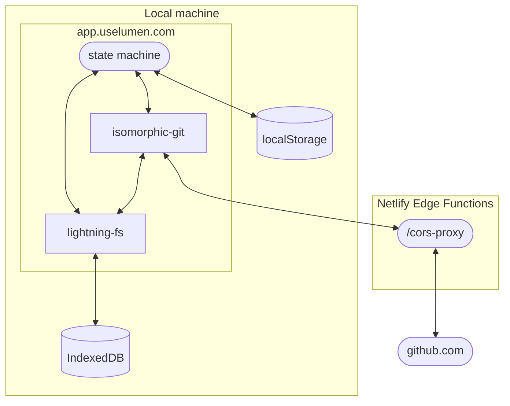

# Contributing

## Local development

1.  Clone the repository using your preferred method:

    ```shell
    # HTTPS
    git clone https://github.com/lumen-notes/lumen.git

    # SSH
    git clone git@github.com:lumen-notes/lumen.git

    # GitHub CLI
    gh repo clone lumen-notes/lumen
    ```

1.  Generate a GitHub [personal access token (classic)](https://github.com/github /tokens/new) with `repo`, `gist`, and `user:email` scopes, or a [fine-grained personal access token](https://docs.github.com/en/authentication/keeping-your-account-and-data-secure/managing-your-personal-access-tokens#creating-a-fine-grained-personal-access-token) scoped to a specific repository with the additional read-only email scope and gist, then add it to a `.env.local` file in the root directory:

    ```shell
    VITE_GITHUB_PAT=<your token here>
    ```

1.  Install the dependencies:

    ```shell
    npm install
    ```

1.  Start the development server:

    ```shell
    npm run dev:netlify
    ```

1.  Open the app at http://localhost:8888


## Architecture

### GitHub sync


